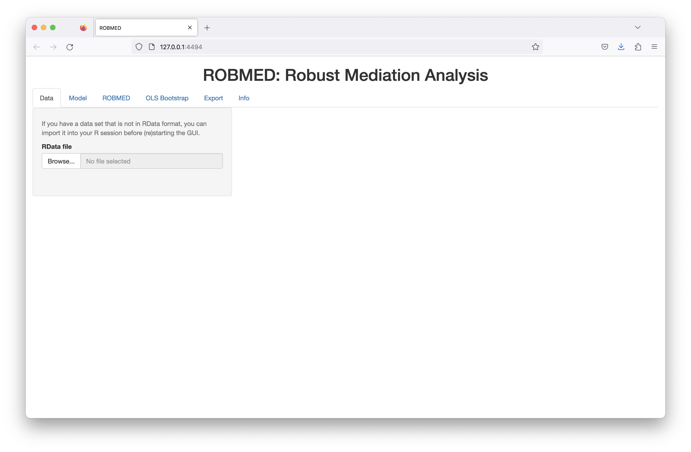

<style>
body {text-align: justify}
</style>

```{r, include = FALSE}
knitr::opts_chunk$set(
  collapse = TRUE,
  comment = "#"
)
```

```{r setup, message = FALSE}
library("robmedExtra")
```


```{r start-GUI, eval = FALSE}
robmed_GUI()
```

<div class="figure">

<p class="caption" style="text-align: justify"><em>Figure 1:</em> The graphical user interface for (robust) mediation analysis after startup from a new `R` session with an empty environment.</p>
</div>


## *Data* tab

## *Model* tab

## *ROBMED* tab

## *OLS Bootstrap* tab

## *Export* tab

## *Info* tab
